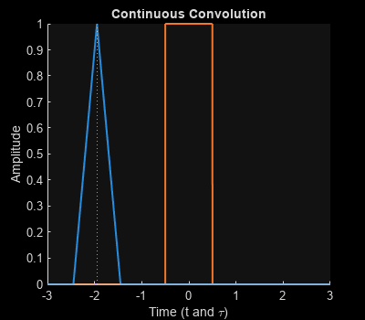
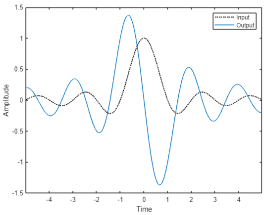
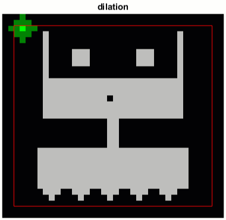

# Convolution in Digital Signal Processing

 or 

**Curriculum Module**

_Created with R2024a. Compatible with R2024a and later releases._

# Information

This curriculum module contains interactive [MATLAB® live scripts](https://www.mathworks.com/products/matlab/live-editor.html) and supporting data files centered around the fundamentals of convolution in digital signal processing. 

## Background

You can use these live scripts as demonstrations in lectures, class activities, or interactive assignments outside class. This module covers the definition and computation of 1D and 2D convolution, as well as the concepts of linear time invariant systems and filtering. It also includes examples of audio and image manipulation using convolution.

The instructions inside the live scripts will guide you through the exercises and activities. Get started with each live script by running it one section at a time. To stop running the script or a section midway (for example, when an animation is in progress), use the  Stop button in the **RUN** section of the **Live Editor** tab in the MATLAB Toolstrip.

## Contact Us

Solutions are available upon instructor request. Contact the [MathWorks teaching resources team](mailto:onlineteaching@mathworks.com) if you would like to request solutions, provide feedback, or if you have a question.

## Prerequisites

This module assumes knowledge of MATLAB at the level of the [<u>MATLAB Onramp</u>](https://matlabacademy.mathworks.com/details/matlab-onramp/gettingstarted) – a free two\-hour introductory tutorial that teaches the essentials of MATLAB.

## Getting Started
### Accessing the Module
### **On MATLAB Online:**

Use the  link to download the module. You will be prompted to log in or create a MathWorks account. The project will be loaded, and you will see an app with several navigation options to get you started.

### **On Desktop:**

Download or clone this repository. Open MATLAB, navigate to the folder containing these scripts and double\-click on [Convolution.prj](https://matlab.mathworks.com/open/github/v1?repo=MathWorks-Teaching-Resources/Convolution-Digital-Signal-Processing&project=Convolution.prj&file=README.mlx). It will add the appropriate files to your MATLAB path and open an app that asks you where you would like to start. 

Ensure you have all the required products (listed below) installed. If you need to include a product, add it using the Add\-On Explorer. To install an add\-on, go to the **Home** tab and select   **Add-Ons** > **Get Add-Ons**. 

## Products

MATLAB® and the Signal Processing Toolbox™ are used throughout. To run all of the examples in <samp>ConvolutionFilters.mlx</samp> requires the Image Processing Toolbox™ and the Deep Learning Toolbox™, including the Deep Learning Toolbox Model for AlexNet Network support package.

# Scripts
## [**ConvolutionBasics.mlx**](https://matlab.mathworks.com/open/github/v1?repo=MathWorks-Teaching-Resources/Convolution-Digital-Signal-Processing&project=Convolution.prj&file=Scripts/ConvolutionBasics.mlx) 
|      |      |
| :-- | :-- |
|  | **In this script, students will...**     |
|     | $\bullet$ define and compute convolution of two 1\-D signals   $\bullet$ use FFT to compute convolution   $\bullet$ define and compute circular convolution   $\bullet$ achieve equivalence between circular and linear convolution     |
|      |       |

## [**ConvolutionLTI.mlx**](https://matlab.mathworks.com/open/github/v1?repo=MathWorks-Teaching-Resources/Convolution-Digital-Signal-Processing&project=Convolution.prj&file=Scripts/ConvolutionLTI.mlx) 
|      |      |      |
| :-- | :-- | :-- |
|  | **In this script, students will...**    | **Application**     |
|     | $\bullet$ define a linear time invariant (LTI) system   $\bullet$ identify the moving average operation as a simple LTI system   $\bullet$ compute the output of an LTI system for an arbitrary input signal given its impulse response    | $\bullet$ Transform a monophone signal to two channel stereo with reverberation     |
|      |      |       |

## [**ConvolutionFilters.mlx**](https://matlab.mathworks.com/open/github/v1?repo=MathWorks-Teaching-Resources/Convolution-Digital-Signal-Processing&project=Convolution.prj&file=Scripts/ConvolutionFilters.mlx) 
|      |      |      |
| :-- | :-- | :-- |
|  | **In this script, students will...**    | **Applications**     |
|     | $\bullet$ explain the frequency domain implications of convolving two signals in the time domain   $\bullet$ achieve equivalence between low pass filtering and convolution   $\bullet$ define and compute convolution of two 2\-D signals   $\bullet$ perform spatial filtering of images to achieve effects such as blurring and embossing    | $\bullet$ Blurring images   $\bullet$ Sharpening images   $\bullet$ Using convolution to identify parts of an image   $\bullet$ Using pretrained convolutional neural network to identify images     |
|      |      |       |

## [**PracticeProblems.mlx**](https://matlab.mathworks.com/open/github/v1?repo=MathWorks-Teaching-Resources/Convolution-Digital-Signal-Processing&project=Convolution.prj&file=Scripts/PracticeProblems.mlx) 
# Related Courseware Modules
|      |      |      |
| :-- | :-- | :-- |
| **Courseware Module**    | **Sample Content**    | **Available on:**     |
| [**Binary Morphology in Image Processing**](https://www.mathworks.com/matlabcentral/fileexchange/94590-binary-morphology-in-image-processing)    |     |       [GitHub](https://github.com/MathWorks-Teaching-Resources/Morphology-in-Image-Processing)     |
| [**Climate Data Visualization and Analysis**](https://www.mathworks.com/matlabcentral/fileexchange/110125-climate-data-visualization-and-analysis)    |     |       [GitHub](https://github.com/MathWorks-Teaching-Resources/Climate-Data-Visualization-and-Analysis)     |
|      |      |       |

Or feel free to explore our other [modular courseware content](https://www.mathworks.com/matlabcentral/fileexchange/?q=tag%3A%22courseware+module%22&sort=downloads_desc_30d).

# Educator Resources
-  [Educator Page](https://www.mathworks.com/academia/educators.html) 

# Contribute 

Looking for more? Find an issue? Have a suggestion? Please contact the [MathWorks teaching resources team](mailto:%20onlineteaching@mathworks.com). If you want to contribute directly to this project, you can find information about how to do so in the [CONTRIBUTING.md](https://github.com/MathWorks-Teaching-Resources/Convolution-Digital-Signal-Processing/blob/release/CONTRIBUTING.md)  page on GitHub.

 *©* Copyright 2023 The MathWorks™, Inc

